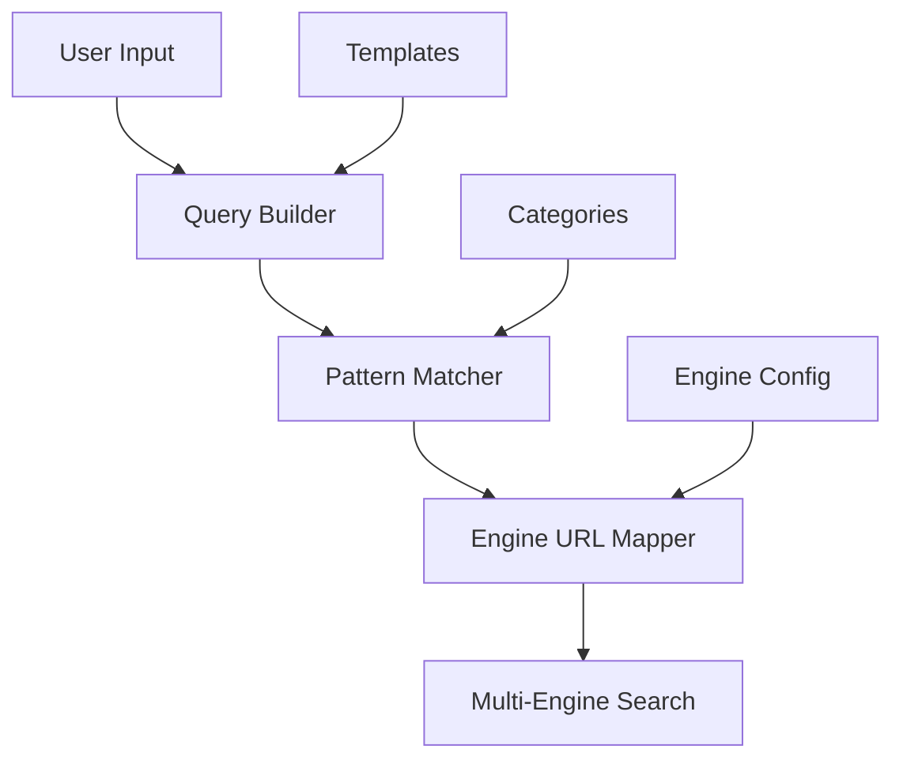

# SearchHub

<div align="center">
  
  <h3>Advanced Multi-Engine Search Interface</h3>
  <p>Craft powerful searches across multiple engines with one intuitive interface.</p>
</div>

[Live Demo](https://portablepandadev.github.io/SearchHub/) | [Documentation](./MANUAL.md) | [Contributing](./CONTRIBUTING.md)

## Features at a Glance


- 🔍 **Multi-Engine Search:** Run queries across Google, Bing, DuckDuckGo, GitHub, and more simultaneously
- 🛠️ **Advanced Query Building:** Rich syntax support, templates, and pattern matching
- 🔒 **Privacy First:** No tracking, no external APIs, runs entirely in your browser
- 📱 **Modern Interface:** Responsive design, dark mode, keyboard shortcuts
- 🎯 **Search Categories:** Specialized patterns for files, code, domains, and researchb

SearchHub is a customizable, privacy-respecting search interface that lets you fire complex queries across multiple engines from one place. Built for researchers, OSINT enthusiasts, and anyone who’s tired of retyping the same query on multiple sites.

## Features
- Unified search bar for multiple engines (Google, Bing, DuckDuckGo, GitHub, and more)
- Advanced options for file types, categories, and search modes (Safe Mode, Disabled Mode, etc.)
- Customizable query templates
- Privacy-first: no tracking, no data sent to third parties
- Modern, responsive UI

## Quick Start

1. Visit [SearchHub](https://portablepandadev.github.io/SearchHub/) or open `index.html` locally
2. Select search engines (multiple supported)
3. Choose a category (e.g., Web, Files, Code)
4. Enter your query
5. Hit Enter or click Search


## Architecture

SearchHub is built as a modern, static web application with a focus on modularity and extensibility.

### High-Level Architecture



### Core Components

#### Query Builder (src/js/query.js)
- Processes raw user input
- Applies syntax rules and operators
- Handles special characters and escaping
- Integrates with pattern matching system

#### Pattern Matcher (src/js/components/QuerySuggester.js)
- Category-specific search patterns
- Dynamic operator suggestions
- Context-aware completions
- Template integration

#### Engine URL Mapper (src/js/engines.js)
- Converts unified query to engine-specific URLs
- Handles engine-specific syntax requirements
- Manages search engine configurations
- Controls multi-tab launching

### Data Flow

1. **User Input → Query Builder**
   - Raw query text is processed
   - Basic syntax validation
   - Operator normalization

2. **Query Builder → Pattern Matcher**
   - Pattern detection
   - Category-specific rules
   - Template application
   - Suggestion generation

3. **Pattern Matcher → Engine URL Mapper**
   - Final query construction
   - Engine-specific formatting
   - URL generation
   - Search execution

### Configuration

Search engines are configured in `src/js/config/searchEngines.js`:

```javascript
{
  "google": {
    "name": "Google",
    "baseUrl": "https://www.google.com/search",
    "queryParam": "q",
    "operators": {
      "filetype": "filetype:",
      "site": "site:"
      // ... more operators
    }
  }
  // ... more engines
}
```

Categories and patterns are defined in `src/js/categories.js`:

```javascript
{
  "file_search": {
    "name": "File Search",
    "patterns": [
      "filetype:pdf",
      "filetype:doc",
      // ... more patterns
    ]
  }
  // ... more categories
}
```

## Privacy & "AI" Features

The AI suggestion system runs entirely client-side using:

1. **Pattern Matching:** Pre-defined patterns and templates
2. **Context Analysis:** Query structure and category awareness
3. **No External APIs:** All processing happens in your browser
4. **Configurable:** Can be disabled for maximum privacy

## Contributing

See [CONTRIBUTING.md](./CONTRIBUTING.md) for detailed guidelines.

Quick start:
1. Fork the repository
2. Make your changes
3. Submit a PR

## Security

SearchHub takes security seriously:
- Strict CSP headers
- Input sanitization
- Safe link handling
- See [SECURITY.md](./SECURITY.md) for details

## License

MIT License - see [LICENSE](./LICENSE) for details

## Changelog

### v1.4.0 (2025-08-18)
[Full changelog here](./CHANGELOG.md#v140)

### v1.3.0 (2025-08-18)
- Multi-engine search now preserves advanced search syntax (quotes, operators, etc.) for all engines.
- Added a tooltip next to the search button to inform users about browser popup blockers and how to allow multi-tab search.
- Improved compatibility for advanced queries on DuckDuckGo, Bing, and others.

### v1.2.0 (2025-08-18)
- Wayback Machine option now opens the correct URL, with input validation and domain extraction.
- All DOM writes in history, favorites, and templates are fully sanitized (no user data in innerHTML).
- Fixed all option selector errors (no more querySelector crashes).
- Added a favicon to remove browser 404 errors.
- Fixed subOptionsContainer bug and improved UI logic.
- General UI and security improvements.

### v1.1.0 (2025-08-18)
- Fixed option highlighting for all categories and sub-options
- Improved selector safety for special characters in option values
- Enhanced state management for Safe Mode and Disabled Mode

### v1.0.0
- Initial release: unified search, category options, file search, and advanced features
